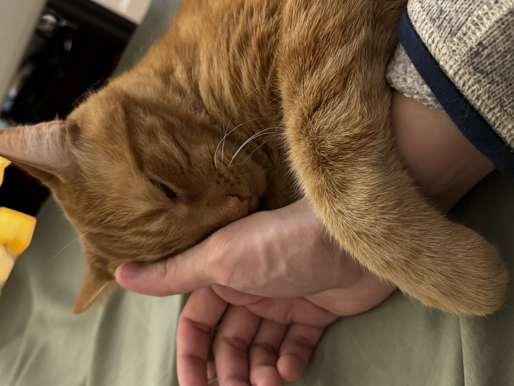
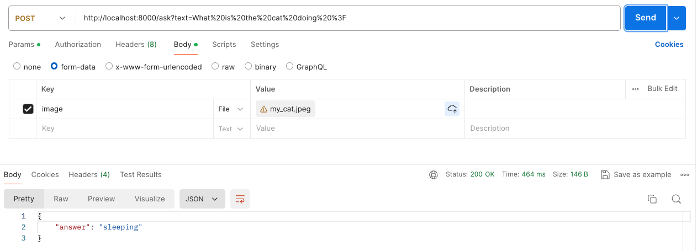
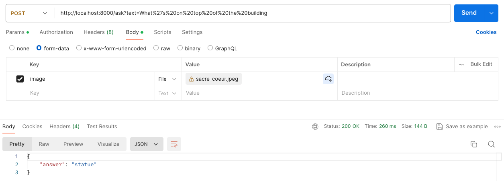

# docker-fastapi-vilt-b32

A simple Vision-and-Language Transformer (ViLT) model fine-tuned on VQAv2, built as an API with FastAPI, managed with Poetry, and containerized using Docker.

## Postman Example Usage

### Visual Question Answering - Example no. 1

**text="What is the cat doing ?"**

**answer: "sleeping"**

### Visual Question Answering - Example no. 2

**text="What's on top of the building ?"**

**"answer": "statue"**

